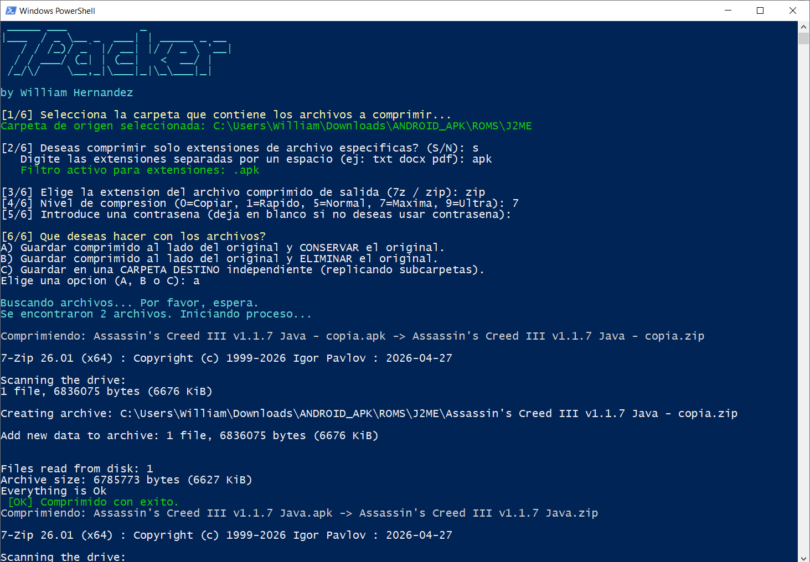

# 7Packer 🚀

   _____ ___           _             
  |___  / _ \__ _  ___| | _____ _ __ 
     / / /_)/ _` |/ __| |/ / _ \ '__|
    / / ___/ (_| | (__|   <  __/ |   
   /_/\/    \__,_|\___|_|\_\___|_|   
                                     
  by William Hernandez

7Packer es un script avanzado e interactivo de PowerShell diseñado para automatizar la compresión de archivos individuales utilizando el motor de **7-Zip**. Es ideal para organizar colecciones de datos, preparar ROMs, respaldar documentos o empaquetar una gran cantidad de archivos de forma masiva e independiente, manteniendo intacta la estructura de tus carpetas.

---

## ✨ Características Principales

* **Instalación Automatizada:** Si el script detecta que no tienes 7-Zip x64 instalado en tu sistema, te ofrecerá instalarlo automáticamente en segundos utilizando `winget`.
* **Interfaz Gráfica (GUI):** Olvídate de escribir rutas molestas; selecciona tus carpetas de origen y destino cómodamente a través de ventanas emergentes nativas de Windows.
* **Filtrado Inteligente de Extensiones:** Elige si deseas procesar todos los archivos o solo extensiones específicas (por ejemplo: `txt docx pdf`), separándolas simplemente con un espacio.
* **Control de Salida Flexible:** Soporta formatos `.7z` y `.zip`, junto con todos los niveles de compresión oficiales (desde *0 - Copiar* hasta *7 - Máxima* y *9 - Ultra*).
* **Seguridad:** Permite asignar contraseñas a los archivos comprimidos. Si eliges el formato `.7z`, aplica cifrado de encabezados de forma automática para ocultar incluso los nombres de los archivos.
* **3 Modos de Flujo de Trabajo:**
  * **Opción A:** Guarda el comprimido junto al original y conserva el archivo original.
  * **Opción B:** Guarda el comprimido junto al original y elimina el archivo original (ideal para ahorrar espacio).
  * **Opción C:** Replica exactamente toda la estructura de subcarpetas en una ubicación de destino completamente independiente.
* **Inmune a Errores de Codificación:** Optimizado con codificación UTF-8 para evitar problemas visuales con acentos o caracteres especiales en la consola de Windows.

---

## 🛠️ Requisitos Previos

* **Sistema Operativo:** Windows 10 o Windows 11.
* **Consola:** Windows PowerShell 5.1 o superior.
* **Privilegios:** Dependiendo de la carpeta que intentes leer/escribir, podrías necesitar ejecutar PowerShell como Administrador.

---

## 🚀 Modo de Uso

1. **Descarga el script:** Descarga el archivo `7Packer.ps1` de este repositorio.
2. **Desbloquea el script (Opcional):** Si Windows bloquea el archivo por seguridad por haber sido descargado de Internet, haz clic derecho sobre `7Packer.ps1`, selecciona **Propiedades**, marca la casilla **Desbloquear** y haz clic en **Aceptar**.
3. **Ejecución:** * Haz clic derecho sobre el archivo `7Packer.ps1` y selecciona **Ejecutar con PowerShell**.
   * *Alternativa desde la consola:* Abre PowerShell, navega hasta la carpeta del script y ejecútalo con:
     ```powershell
     .\7Packer.ps1
     ```

> 💡 **Nota sobre Políticas de Ejecución:** Si PowerShell te muestra un error indicando que la ejecución de scripts está deshabilitada en tu sistema, puedes solucionarlo abriendo una consola de PowerShell y ejecutando el siguiente comando (solo es necesario hacerlo una vez):
> ```powershell
> Set-ExecutionPolicy RemoteSigned -Scope CurrentUser
> ```

---

## 📸 Captura de Pantalla

Así se ve **7Packer** en acción:



---

## 📄 Licencia

Este proyecto está bajo la licencia MIT. Siéntete libre de modificarlo, distribuirlo y adaptarlo a tus necesidades.

---
Desarrollado con ❤️ por **William Hernandez**